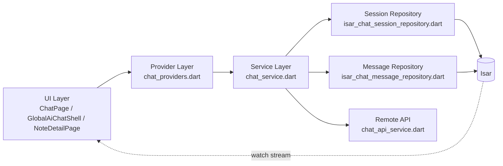
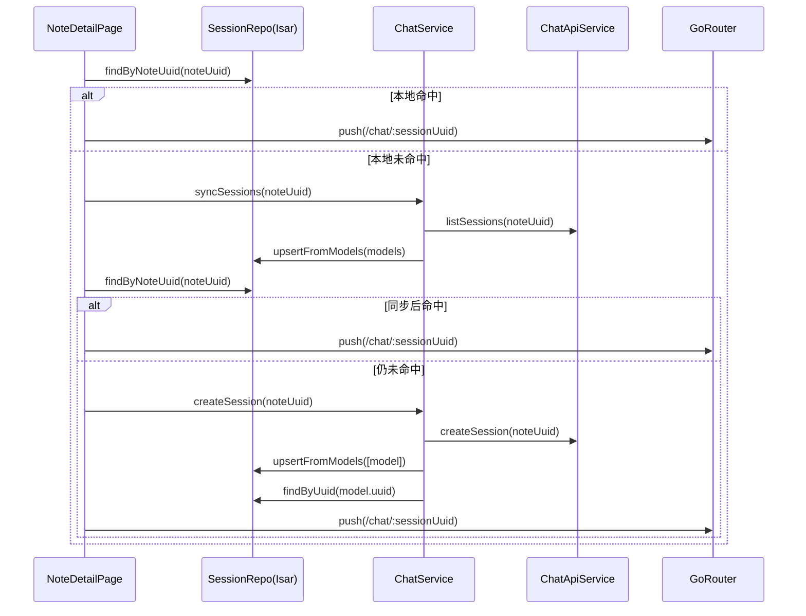
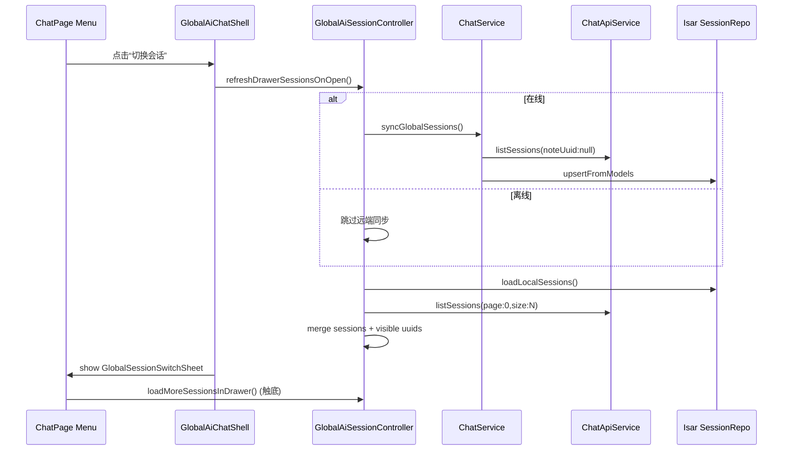
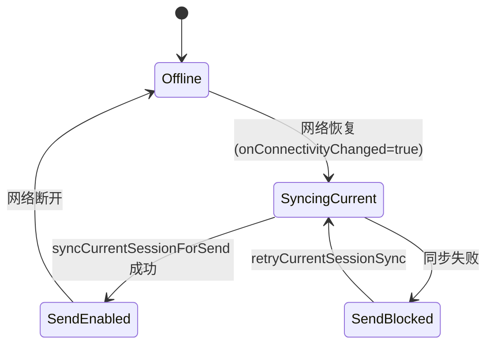

# Mobile AI Chat Client（PocketMind）

本 Skill 用于 PocketMind `mobile/` 聊天能力开发与排障，目标是让 Agent 与开发者都能快速建立统一认知：
- 聊天链路如何在 note 级与全局级运行
- 状态从 UI 到 Provider 到 Service 到 Repository 如何流动
- 在线/离线、同步/禁发、分页/抽屉的边界如何落地

## 快速导览

- 代码主入口（全局）：`mobile/lib/page/chat/global_ai_chat_shell.dart`
- 代码主入口（note）：`mobile/lib/page/home/note_detail_page.dart` 的 `_goToSessionPressed()`
- 会话状态中心：`mobile/lib/providers/chat_providers.dart`
- 聊天业务编排：`mobile/lib/service/chat_service.dart`
- 会话持久化：`mobile/lib/data/repositories/isar_chat_session_repository.dart`
- 消息持久化：`mobile/lib/data/repositories/isar_chat_message_repository.dart`

## 架构图（总览）



## 架构图（note 级会话链路）



## 架构图（全局多会话抽屉与刷新链路）



## 关键状态机（发送门控）



## 当前实现基线（必须对齐）

### 1) note 级会话（Note -> Chat）

- 入口：`mobile/lib/page/home/note_detail_page.dart` `_goToSessionPressed()`
- 固定顺序：
  1. `findByNoteUuid(noteUuid)` 本地优先
  2. 未命中则 `syncSessions(noteUuid: noteUuid)`
  3. 再查本地仍无则 `createSession(noteUuid: noteUuid)`
  4. `context.push(RoutePaths.chatOf(sessionUuid))`
- 禁止仅依赖 `chatSessionsProvider(...).asData` 判断是否创建会话

### 2) 全局多会话（scopeNoteUuid == null）

- 状态模型：`GlobalAiSessionState`
  - `currentSessionUuid`
  - `sessionUuidsVisibleInDrawer` / `drawerNextPage` / `hasMoreInDrawer`
  - `isOnline` / `isSyncingCurrentSession` / `canSendCurrentSession` / `currentSessionSyncError`
- 控制器：`GlobalAiSessionController`
  - `ensureActiveSession()` / `createOrReuseEmptySession()` / `switchSession()` / `deleteSession()`
  - `refreshDrawerSessionsOnOpen()` / `loadMoreSessionsInDrawer()`
  - `onConnectivityChanged()` / `syncCurrentSessionForSend()` / `retryCurrentSessionSync()`

### 3) ChatPage 行为基线

- 文件：`mobile/lib/page/chat/chat_page.dart`
- 菜单：新建会话 / 切换会话 / 重命名会话 / 查看分支 / 删除会话
- 本地分页：首屏 10 条，触顶增量加载，切会话重置分页状态
- 发送门控：`canSend=false` 时显示提示并禁止发送

### 4) 抽屉分页基线

- 文件：`mobile/lib/page/chat/widgets/global_session_switch_sheet.dart`
- 打开抽屉应触发首屏刷新，不依赖用户先滑动
- `onLoadMore` 只在有效向下滚动接近底部触发
- 展示字段：标题、更新时间、最后一条消息预览（单行省略）

### 5) 重命名弹窗基线

- `showInputDialog` 位于 `mobile/lib/page/widget/creative_toast.dart`
- 输入框必须有 Material 祖先，避免 `No Material widget found`

## 回归测试地图（对 Agent 友好）

### 必跑用例

- `mobile/test/chat/chat_service_test.dart`
  - note 级 `syncSessions(noteUuid)`
  - note 级 `createSession(noteUuid, title)`
  - `createSession` 本地回读失败抛 `StateError`
- `mobile/test/chat/global_ai_session_controller_test.dart`
  - 抽屉打开首屏刷新
  - 远端同步失败降级
  - `hasMore=false` 的分页 no-op 守卫
- `mobile/test/widget/global_ai_chat_shell_test.dart`
  - 菜单点击“切换会话”触发刷新并展示远端会话
  - 离线禁发提示
  - 重命名弹窗可正常打开

### 推荐命令

```bash
flutter test test/chat/chat_service_test.dart test/chat/global_ai_session_controller_test.dart test/widget/global_ai_chat_shell_test.dart
```

## 修改流程（执行清单）

1. 先补测试（至少 1 条失败用例证明回归点）
2. 再最小改实现
3. 如动到 `@freezed`/`@riverpod`：
   - `flutter pub run build_runner build --delete-conflicting-outputs`
4. 最小分析：
   - `dart analyze lib/providers/chat_providers.dart lib/page/chat/global_ai_chat_shell.dart lib/page/chat/chat_page.dart lib/page/chat/widgets/global_session_switch_sheet.dart lib/page/widget/creative_toast.dart lib/page/home/note_detail_page.dart`
5. 跑关键回归测试并记录结果

## 常见回归与排查索引

- 现象：点击切换会话看不到远端新增
  - 首查：`GlobalAiChatShell._showSessionSwitchSheet()` 是否调用 `refreshDrawerSessionsOnOpen()`
- 现象：note 点击 AI 每次都新建会话
  - 首查：`_goToSessionPressed()` 是否保持“本地查 -> 同步 -> 再查 -> 创建”顺序
- 现象：离线还能发送
  - 首查：`canSendCurrentSession` 是否受 `isOnline` 与同步状态共同约束
- 现象：重命名弹窗红屏
  - 首查：`showInputDialog` 根节点是否含 `Material`

## 交付输出要求

- 列出修改文件路径
- 声明是否执行 build_runner
- 给出 `dart analyze` 与测试命令结果
- 若改同步策略，明确在线/离线与一致性边界
