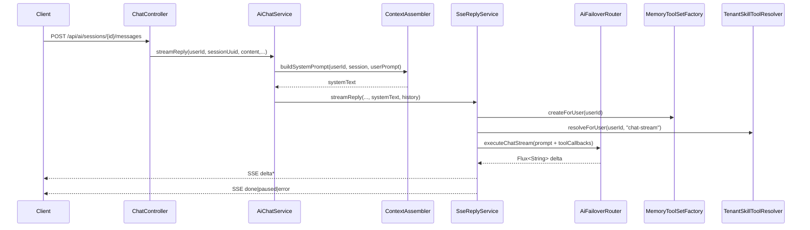
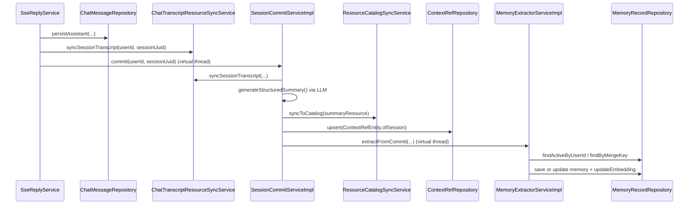

# PocketMind Context Architecture

## 1. 架构现状总览

### 1.1 已落地的核心设计

当前后端已形成一条可运行的“对话上下文闭环”：

- 请求期上下文注入：`ChatController.sendMessage` -> `AiChatService.streamReply` -> `ContextAssembler.buildSystemPrompt`
- 流式生成与工具注入：`SseReplyService.streamReply`（注入 Memory Tool + Tenant Skill Tool，输出 SSE）
- 终态沉淀：`SseReplyService.handleDoneTerminal` 异步触发 `SessionCommitServiceImpl.commit`
- 会话提交后扩展：`SessionCommitServiceImpl.commit` 异步触发 `MemoryExtractorServiceImpl.extractFromCommit`

代码锚点：

- `backend/pocketmind-server/src/main/java/com/doublez/pocketmindserver/ai/api/ChatController.java`
- `backend/pocketmind-server/src/main/java/com/doublez/pocketmindserver/ai/application/AiChatService.java`
- `backend/pocketmind-server/src/main/java/com/doublez/pocketmindserver/ai/application/stream/SseReplyService.java`
- `backend/pocketmind-server/src/main/java/com/doublez/pocketmindserver/context/application/SessionCommitServiceImpl.java`
- `backend/pocketmind-server/src/main/java/com/doublez/pocketmindserver/memory/application/MemoryExtractorServiceImpl.java`

### 1.2 当前“上下文”分层（按代码实体）

- 业务真相层：`ChatSessionEntity`、`ChatMessageEntity`、`NoteEntity`
- 资源投影层：`ResourceRecordEntity` + `NoteResourceSyncServiceImpl` + `ChatTranscriptResourceSyncServiceImpl`
- 上下文目录索引层：`ContextNode` + `ContextCatalogRepository`（MyBatis 实现 + 向量检索）
- 长期记忆层：`MemoryRecordEntity` + `MemoryRecordRepository`（关键词检索 + pgvector 检索）
- 会话提交层：`SessionCommitServiceImpl`（摘要生成、ContextRef 关联、热度累计）
- 请求级能力注入层：`MemoryToolSet` + `TenantSkillToolResolver`

### 1.3 上下文注入策略（已实现）

`ContextAssembler.buildSystemPrompt` 存在两条分支：

- 笔记会话分支（`session.getScopeNoteUuid()!=null`）：
  - 直接读取 `ResourceRecordRepository.findByNoteUuid`，按 `ResourceSourceType` 组装 `NOTE_TEXT/WEB_CLIP` 片段
  - OCR 文本来自 `AttachmentVisionRepository.findDoneByNoteUuid`
  - 记忆来自 `MemoryQueryService.buildMemoryContext`（关键词检索）
- 全局会话分支：
  - `IntentAnalyzer.analyze` 判定是否触发检索
  - `RetrievalOrchestrator.retrieve` 并行检索 `Resource` 与 `Memory`
  - 检索结果通过模板渲染为 `extraSection` 注入系统提示词

代码锚点：

- `backend/pocketmind-server/src/main/java/com/doublez/pocketmindserver/ai/application/context/ContextAssembler.java`
- `backend/pocketmind-server/src/main/java/com/doublez/pocketmindserver/ai/application/retrieval/RetrievalOrchestrator.java`
- `backend/pocketmind-server/src/main/java/com/doublez/pocketmindserver/ai/application/retrieval/LlmIntentAnalyzer.java`

### 1.4 状态管理与热度机制（已实现）

- 流式状态：`ChatStreamCancellationManager` 通过 `streamKey(userId:sessionUuid:requestId)` 管理取消信号
- SSE 终态：`ChatSseEventFactory` 统一输出 `delta/done/paused/error`
- 热度统计：
  - 检索命中时，`memory_records.active_count` 与 `context_catalog.active_count` 会被递增
  - `DefaultHierarchicalRetriever` 在排序阶段融合 `HotnessScorer`

代码锚点：

- `backend/pocketmind-server/src/main/java/com/doublez/pocketmindserver/ai/application/stream/ChatStreamCancellationManager.java`
- `backend/pocketmind-server/src/main/java/com/doublez/pocketmindserver/ai/application/stream/ChatSseEventFactory.java`
- `backend/pocketmind-server/src/main/java/com/doublez/pocketmindserver/ai/application/retrieval/DefaultHierarchicalRetriever.java`

## 2. 核心链路时序

### 2.1 对话请求到上下文注入与流式响应



### 2.2 done 终态后的提交与记忆沉淀



### 2.3 检索编排与层级搜索

```mermaid
graph TD
    A[ContextAssembler.buildGlobalPrompt] --> B[IntentAnalyzer.analyze]
    B -->|needsRetrieval=true| C[RetrievalOrchestrator.retrieve]
    C --> D[HierarchicalRetriever.retrieve - Resource]
    C --> E[MemoryRetriever.retrieve - Memory]
    D --> F[ChildSearchStrategy
DbChildSearchStrategy 或 VectorChildSearchStrategy]
    D --> G[HotnessScorer 融合排序]
    E --> H[VectorMemoryRetriever -> memory_records pgvector]
    C --> I[OrchestratedContext(resourceSnippets,memorySnippets)]
    I --> J[ContextAssembler 渲染 extraSection 注入 system prompt]
```

## 3. 模块与代码映射表

| 模块 | 职责 | 核心类/方法 | 文件路径 |
|---|---|---|---|
| API 入口 | 会话/消息/SSE 协议层 | `ChatController.sendMessage`, `regenerateMessage`, `stopMessage` | `backend/pocketmind-server/src/main/java/com/doublez/pocketmindserver/ai/api/ChatController.java` |
| 对话编排 | 会话校验、历史加载、system prompt 构建、消息落库 | `AiChatService.streamReply`, `regenerateReply` | `backend/pocketmind-server/src/main/java/com/doublez/pocketmindserver/ai/application/AiChatService.java` |
| 上下文装配 | 全局/笔记双分支装配，注入 Memory/Resource/OCR | `ContextAssembler.buildSystemPrompt`, `buildGlobalPrompt`, `buildNoteScopedPrompt` | `backend/pocketmind-server/src/main/java/com/doublez/pocketmindserver/ai/application/context/ContextAssembler.java` |
| 流式执行 | 模型流式调用、SSE 终态、取消控制、触发 commit | `SseReplyService.streamReply`, `handleDoneTerminal`, `triggerSessionCommitAsync` | `backend/pocketmind-server/src/main/java/com/doublez/pocketmindserver/ai/application/stream/SseReplyService.java` |
| SSE 事件工厂 | 标准事件帧构建 | `ChatSseEventFactory.delta/done/paused/error` | `backend/pocketmind-server/src/main/java/com/doublez/pocketmindserver/ai/application/stream/ChatSseEventFactory.java` |
| 取消管理 | 单机内存取消信号管理 | `ChatStreamCancellationManager.listenCancel/cancel` | `backend/pocketmind-server/src/main/java/com/doublez/pocketmindserver/ai/application/stream/ChatStreamCancellationManager.java` |
| 会话提交 | transcript 同步、摘要生成、summary 资源落地、ContextRef 建联 | `SessionCommitServiceImpl.commit`, `createOrUpdateSummaryResource` | `backend/pocketmind-server/src/main/java/com/doublez/pocketmindserver/context/application/SessionCommitServiceImpl.java` |
| 资源同步（会话） | 聊天消息 -> `CHAT_TRANSCRIPT` 资源 | `ChatTranscriptResourceSyncServiceImpl.syncSessionTranscript` | `backend/pocketmind-server/src/main/java/com/doublez/pocketmindserver/resource/application/ChatTranscriptResourceSyncServiceImpl.java` |
| 资源同步（笔记） | Note/WebClip -> Resource 投影与同步 | `NoteResourceProjectionServiceImpl.projectNoteText/projectWebClip`, `NoteResourceSyncServiceImpl.syncProjectedResources` | `backend/pocketmind-server/src/main/java/com/doublez/pocketmindserver/resource/application/NoteResourceProjectionServiceImpl.java`, `backend/pocketmind-server/src/main/java/com/doublez/pocketmindserver/resource/application/NoteResourceSyncServiceImpl.java` |
| 目录索引同步 | Resource -> context_catalog(L0目录+L2叶子) + embedding | `ResourceCatalogSyncServiceImpl.syncToCatalog` | `backend/pocketmind-server/src/main/java/com/doublez/pocketmindserver/resource/application/ResourceCatalogSyncServiceImpl.java` |
| 检索编排 | 并行检索 Resource/Memory | `RetrievalOrchestrator.retrieve` | `backend/pocketmind-server/src/main/java/com/doublez/pocketmindserver/ai/application/retrieval/RetrievalOrchestrator.java` |
| 意图分析 | LLM 分析是否检索 + 类型化查询 | `LlmIntentAnalyzer.analyze` | `backend/pocketmind-server/src/main/java/com/doublez/pocketmindserver/ai/application/retrieval/LlmIntentAnalyzer.java` |
| 层级检索内核 | 递归搜索、得分传播、收敛终止、热度融合 | `DefaultHierarchicalRetriever.retrieve/recursiveSearch` | `backend/pocketmind-server/src/main/java/com/doublez/pocketmindserver/ai/application/retrieval/DefaultHierarchicalRetriever.java` |
| 子节点检索策略 | 关键词策略 + 向量策略 | `DbChildSearchStrategy`, `VectorChildSearchStrategy` | `backend/pocketmind-server/src/main/java/com/doublez/pocketmindserver/ai/application/retrieval/DbChildSearchStrategy.java`, `backend/pocketmind-server/src/main/java/com/doublez/pocketmindserver/ai/application/retrieval/VectorChildSearchStrategy.java` |
| 记忆检索 | 向量检索记忆并增加热度 | `VectorMemoryRetriever.retrieve` | `backend/pocketmind-server/src/main/java/com/doublez/pocketmindserver/ai/application/retrieval/VectorMemoryRetriever.java` |
| 记忆抽取 | 会话摘要 -> 记忆候选 -> mergeKey 去重 -> 保存/更新 | `MemoryExtractorServiceImpl.extractFromCommit` | `backend/pocketmind-server/src/main/java/com/doublez/pocketmindserver/memory/application/MemoryExtractorServiceImpl.java` |
| 记忆工具 | AI 主动发现记忆（browse/search/detail） | `MemoryToolSet.browseMemoryCategories/searchMemories/getMemoryDetail` | `backend/pocketmind-server/src/main/java/com/doublez/pocketmindserver/memory/application/MemoryToolSet.java` |
| 技能工具注入 | 租户/agent 目录解析并注入 SkillsTool | `TenantSkillToolResolver.resolveForUser`, `MultiTenantSkillsToolFactory.resolve` | `backend/pocketmind-server/src/main/java/com/doublez/pocketmindserver/ai/tool/skill/TenantSkillToolResolver.java`, `backend/pocketmind-server/src/main/java/com/doublez/pocketmindserver/ai/tool/skill/MultiTenantSkillsToolFactory.java` |
| URI 与层级模型 | 统一 Context URI 与层级枚举 | `ContextUri`, `ContextLayer`, `ContextType` | `backend/pocketmind-server/src/main/java/com/doublez/pocketmindserver/context/domain/ContextUri.java`, `backend/pocketmind-server/src/main/java/com/doublez/pocketmindserver/context/domain/ContextLayer.java`, `backend/pocketmind-server/src/main/java/com/doublez/pocketmindserver/context/domain/ContextType.java` |

## 4. 已知局限与 TODO（基于代码现状）

1. 检索根目录只自动覆盖 `RESOURCE/MEMORY`，`SKILL/SESSION` 尚未进入默认检索根。  
证据：`DefaultHierarchicalRetriever.resolveRootUris` 注释“`SKILL 和 SESSION 留给后续阶段，暂不加入自动根节点`”。  
文件：`backend/pocketmind-server/src/main/java/com/doublez/pocketmindserver/ai/application/retrieval/DefaultHierarchicalRetriever.java`

2. `ResourceCatalogSyncServiceImpl.removeFromCatalog` 目前仅日志保留，未执行级联清理。  
证据：方法体注释“`当前阶段通过 context_catalog 的逻辑删除实现，后续可扩展为真正的级联清理`”，当前未调用 repository 删除接口。  
文件：`backend/pocketmind-server/src/main/java/com/doublez/pocketmindserver/resource/application/ResourceCatalogSyncServiceImpl.java`

3. 全局检索注入时，Resource 片段只注入标题和摘要，未注入 L2 正文。  
证据：`RetrievalOrchestrator.retrieveResources` 构造 `ContextSnippet(..., content=null, ...)`；`ContextAssembler.renderResourceSnippetsSection` 仅渲染 `title/abstractText`。  
文件：`backend/pocketmind-server/src/main/java/com/doublez/pocketmindserver/ai/application/retrieval/RetrievalOrchestrator.java`、`backend/pocketmind-server/src/main/java/com/doublez/pocketmindserver/ai/application/context/ContextAssembler.java`

4. 记忆查询存在“双实现并存”：笔记会话仍使用关键词检索，检索编排链路使用向量检索。  
证据：`MemoryQueryServiceImpl.buildMemoryContext` 调用 `searchByKeyword`；`VectorMemoryRetriever.retrieve` 调用 `searchByVector`。  
影响：同一请求面可能出现召回策略不一致。  
文件：`backend/pocketmind-server/src/main/java/com/doublez/pocketmindserver/ai/application/memory/MemoryQueryServiceImpl.java`、`backend/pocketmind-server/src/main/java/com/doublez/pocketmindserver/ai/application/retrieval/VectorMemoryRetriever.java`

5. 请求取消为单机内存实现，未见跨实例分布式取消语义。  
证据：`ChatStreamCancellationManager` 使用 `ConcurrentHashMap<String, Sinks.One<String>>` 存储取消 sink。  
文件：`backend/pocketmind-server/src/main/java/com/doublez/pocketmindserver/ai/application/stream/ChatStreamCancellationManager.java`

6. 租户键当前由 `userId` 直接派生（`tenantKey = "user-" + userId`），多租户模型仍是“用户即租户”策略。  
证据：`TenantSkillToolResolver.resolveForUser` 的 tenantKey 计算逻辑。  
文件：`backend/pocketmind-server/src/main/java/com/doublez/pocketmindserver/ai/tool/skill/TenantSkillToolResolver.java`

7. 记忆类型过滤文案与枚举不完全一致。  
证据：`MemoryToolSet.searchMemories` 的工具参数描述仅列 `PROFILE/PREFERENCES/ENTITIES/EVENTS`，但 `MemoryType` 枚举还包含 `CASES/PATTERNS/TOOL_EXPERIENCE/SKILL_EXECUTION`。  
文件：`backend/pocketmind-server/src/main/java/com/doublez/pocketmindserver/memory/application/MemoryToolSet.java`、`backend/pocketmind-server/src/main/java/com/doublez/pocketmindserver/memory/domain/MemoryType.java`

8. `ContextUri` 结构已支持 `tenant/agent/session` 路径，但当前资源/记忆落地主要集中在 `pm://users/{id}/resources` 与 `pm://users/{id}/memories`。  
证据：`ResourceContextServiceImpl` 与 `MemoryContextServiceImpl` 的 URI 构建方法。  
文件：`backend/pocketmind-server/src/main/java/com/doublez/pocketmindserver/resource/application/ResourceContextServiceImpl.java`、`backend/pocketmind-server/src/main/java/com/doublez/pocketmindserver/memory/application/MemoryContextServiceImpl.java`

---

本文档仅描述当前仓库中可验证代码现状，不包含目标态推演。
