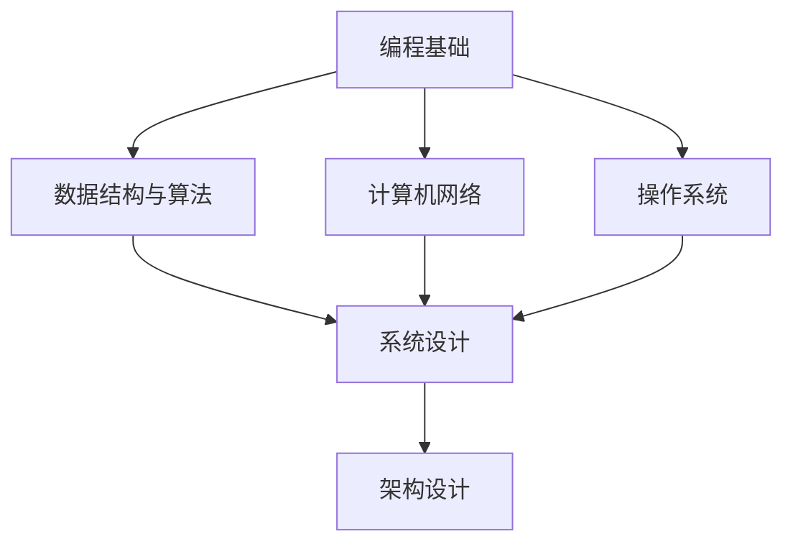

我来为你创建几个不同的Markdown格式文本示例。这些示例展示了Markdown的各种功能和格式：

## 1. 技术文档格式

```markdown
# API 接口文档 v1.0

## 概述
这是一个示例API接口文档，展示了Markdown的技术文档格式。

### 接口列表
- **GET** `/api/users` - 获取用户列表
- **POST** `/api/users` - 创建新用户
- **PUT** `/api/users/{id}` - 更新用户信息
- **DELETE** `/api/users/{id}` - 删除用户

### 请求示例
```json
{
  "name": "张三",
  "email": "zhangsan@example.com",
  "age": 25
}
```

### 响应示例
```json
{
  "code": 200,
  "message": "success",
  "data": {
    "id": 123,
    "name": "张三",
    "email": "zhangsan@example.com"
  }
}
```

### 注意事项
> 注意：所有API请求都需要在Header中包含认证Token。
```

## 2. 学习笔记格式

```markdown
# ClassLoader 学习笔记

## 整体架构
### 类加载器层次结构
1. **Bootstrap ClassLoader**
   - 加载JVM核心类库
   - 由C++实现，Java代码中无法直接引用
   - 加载路径：`jre/lib`目录

2. **Extension ClassLoader**
   - 加载扩展类库
   - 继承自`java.lang.ClassLoader`
   - 加载路径：`jre/lib/ext`目录

3. **Application ClassLoader**
   - 加载应用程序类
   - 也称为System ClassLoader
   - 加载CLASSPATH指定的类

### 双亲委派模型
```java
protected Class<?> loadClass(String name, boolean resolve)
    throws ClassNotFoundException {
    synchronized (getClassLoadingLock(name)) {
        // 检查是否已加载
        Class<?> c = findLoadedClass(name);
        if (c == null) {
            try {
                if (parent != null) {
                    c = parent.loadClass(name, false);
                } else {
                    c = findBootstrapClassOrNull(name);
                }
            } catch (ClassNotFoundException e) {
                // 父类加载器无法加载
            }
            
            if (c == null) {
                c = findClass(name);
            }
        }
        return c;
    }
}
```

## Android 应用场景
### 类加载器类型
- **PathClassLoader**: 加载已安装APK中的类
- **DexClassLoader**: 加载外部DEX/JAR文件
- **InMemoryDexClassLoader**: Android 8.0+，从内存加载DEX

### 热修复原理
1. **类替换机制**
    - 利用双亲委派模型的缺陷
    - 自定义ClassLoader加载修复类
    - 替换原有类的引用

2. **实现步骤**
    - 生成补丁DEX文件
    - 创建自定义ClassLoader加载补丁
    - 反射替换Application的ClassLoader
    - 通过反射调用修复方法
```

## 3. 项目计划格式

```markdown
# 项目开发计划

## 🎯 项目目标
- [ ] 完成核心功能开发
- [ ] 实现用户认证系统
- [ ] 部署到生产环境
- [ ] 编写完整文档

## 📅 时间安排
| 阶段 | 开始日期 | 结束日期 | 负责人 | 状态 |
|------|----------|----------|--------|------|
| 需求分析 | 2024-01-01 | 2024-01-07 | 张三 | ✅ 完成 |
| 系统设计 | 2024-01-08 | 2024-01-14 | 李四 | 🔄 进行中 |
| 开发实现 | 2024-01-15 | 2024-02-15 | 王五 | ⏳ 待开始 |
| 测试验收 | 2024-02-16 | 2024-02-28 | 赵六 | ⏳ 待开始 |

## 📊 进度跟踪
### 本周完成
- ✓ 用户模块API设计
- ✓ 数据库表结构设计
- ✓ 开发环境搭建

### 下周计划
- [ ] 实现用户注册功能
- [ ] 编写单元测试
- [ ] 完成API文档

## ⚠️ 风险与问题
1. **技术风险**
   - 第三方API集成可能延迟
   - 性能优化需要更多时间

2. **资源风险**
   - 开发人员可能临时请假
   - 服务器资源需要提前申请
```

## 4. 个人简历格式

```markdown
# 张三 - 高级软件工程师

## 📞 联系方式
- **邮箱**: zhangsan@example.com
- **电话**: 138-0013-8000
- **GitHub**: [github.com/zhangsan](https://github.com/zhangsan)
- **地址**: 福建省宁德市福安市甘棠镇

## 🎓 教育背景
### 福州大学 | 计算机科学与技术 | 本科
**2015-2019**
- GPA: 3.8/4.0
- 主修课程：数据结构、算法设计、操作系统、计算机网络

## 💼 工作经历
### 高级软件工程师 | ABC科技有限公司
**2021年至今**
- 负责后端系统架构设计与开发
- 主导微服务架构迁移项目
- 优化系统性能，QPS提升300%
- 技术栈：Java, Spring Boot, MySQL, Redis, Docker

### 软件工程师 | XYZ软件公司  
**2019-2021**
- 参与企业级ERP系统开发
- 实现核心业务模块
- 获得"年度优秀员工"称号

## 🛠️ 技术栈
### 编程语言
- **精通**: Java, Python
- **熟悉**: JavaScript, Go
- **了解**: Rust, C++

### 框架与工具
- **后端**: Spring Boot, Django, Flask
- **数据库**: MySQL, PostgreSQL, MongoDB
- **中间件**: Redis, RabbitMQ, Kafka
- **运维**: Docker, Kubernetes, AWS

## 📈 项目经验
### 电商平台微服务架构重构
**项目描述**: 将单体应用拆分为10+微服务
**我的贡献**:
- 设计服务拆分方案
- 实现用户服务和订单服务
- 搭建服务注册与发现中心
- 性能优化：响应时间减少60%

### 高并发秒杀系统
**项目描述**: 支持10万+ QPS的秒杀系统
**关键技术**:
- Redis缓存预热与库存扣减
- 消息队列削峰填谷
- 限流熔断机制
- 分布式锁保证数据一致性
```

## 5. 博客文章格式

```markdown
# 如何高效学习编程：我的十年经验总结

> 本文分享我作为程序员十年的学习心得和方法论，希望能帮助正在学习编程的你少走弯路。

## 📚 学习路径规划

### 第一阶段：打好基础（3-6个月）
1. **选择一门语言**
   - Python：语法简单，适合初学者
   - Java：企业级应用广泛
   - JavaScript：前端必备

2. **掌握核心概念**
   - 变量与数据类型
   - 控制结构（条件、循环）
   - 函数与模块
   - 面向对象编程

### 第二阶段：项目实践（6-12个月）
```python
# 示例：简单的待办事项应用
class TodoItem:
    def __init__(self, title, completed=False):
        self.title = title
        self.completed = completed
    
    def mark_complete(self):
        self.completed = True
    
    def __str__(self):
        status = "✓" if self.completed else "✗"
        return f"{status} {self.title}"

# 使用示例
todo = TodoItem("学习Python")
todo.mark_complete()
print(todo)  # 输出: ✓ 学习Python
```

### 第三阶段：深入专业领域（1-2年）
根据兴趣选择方向：
- **Web开发**: HTML/CSS, JavaScript, 框架（React/Vue）
- **移动开发**: Android（Java/Kotlin）, iOS（Swift）
- **数据科学**: Python, 数据分析, 机器学习
- **系统开发**: C/C++, 操作系统, 网络编程

## 🎯 高效学习方法

### 1. 刻意练习
- **明确目标**: 每次学习解决一个具体问题
- **及时反馈**: 通过测试和代码审查获得反馈
- **走出舒适区**: 挑战略高于当前水平的任务

### 2. 项目驱动学习
| 项目类型 | 适合阶段 | 技术栈 |
|----------|----------|--------|
| 个人博客 | 初级 | HTML, CSS, JavaScript |
| 待办事项应用 | 中级 | React, Node.js, MongoDB |
| 电商网站 | 高级 | 微服务, Docker, Kubernetes |

### 3. 建立知识体系


## 💡 实用建议

### 工具推荐
- **代码编辑器**: VS Code, IntelliJ IDEA
- **版本控制**: Git + GitHub
- **学习平台**:
    - [freeCodeCamp](https://www.freecodecamp.org/)
    - [LeetCode](https://leetcode.com/)
    - [Coursera](https://www.coursera.org/)

### 时间管理
- **番茄工作法**: 25分钟专注 + 5分钟休息
- **每日计划**: 前一天晚上规划第二天任务
- **周回顾**: 每周日总结学习进度

### 社区参与
1. **贡献开源项目**
2. **撰写技术博客**
3. **参加技术 meetup**
4. **在 Stack Overflow 回答问题**

## 🚀 持续成长

### 保持学习动力
- 设定短期和长期目标
- 加入学习小组互相监督
- 定期奖励自己的进步

### 应对挫折
> "编程不是关于你知道什么，而是关于你如何思考。" - 佚名

遇到困难时：
1. 休息一下，换个角度思考
2. 分解问题，逐个击破
3. 寻求帮助，不要孤军奋战
4. 记录错误，避免重复犯错

---

**最后的话**: 编程学习是一场马拉松，不是短跑。保持耐心，享受过程，你一定会成为优秀的程序员！

*本文最后更新：2024年1月*
```

这些Markdown格式文本展示了不同的应用场景和格式风格，包括技术文档、学习笔记、项目计划、个人简历和博客文章等。每个示例都使用了Markdown的各种功能，如标题、列表、代码块、表格、引用、任务列表等。